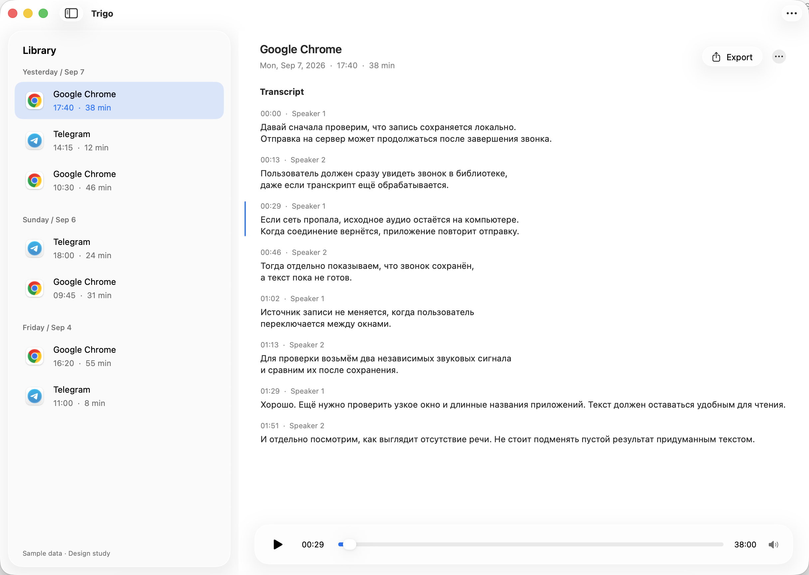
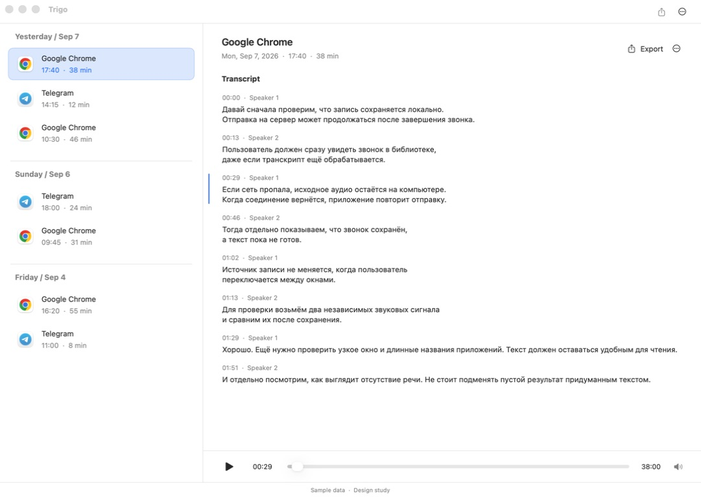
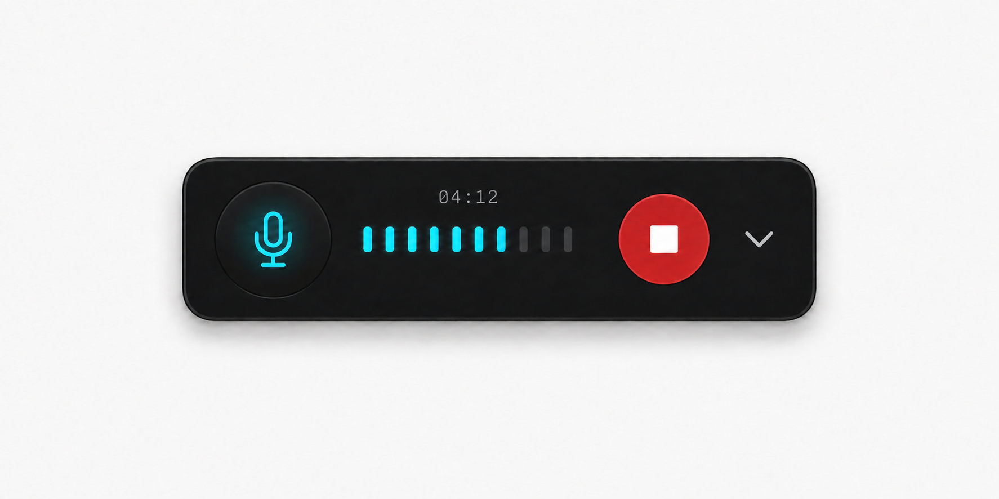

# Retained desktop UX workbench

This native prototype answers the visual question in [Choose the library, menu-bar, and recording-panel mockups](https://github.com/apshenichniy/trigo/issues/67). Preserve it on `codex/prototype-desktop-library` as an interactive workbench for product invariants and intermediate states. It is independent of production application targets; do not import or promote its simulated services into the application.

## Accepted baseline and next iteration — 2026-09-08

The owner accepted the prototype overall, including the floating-sidebar direction, and explicitly requested that it be retained for future work. This accepts the general structure and direction. Further UI work is deferred to the next iteration, with emphasis on the intermediate and recovery states already available in Design Controls.

Keep the runnable source, selected references, native screenshots and verification evidence together. Do not remove this workbench during prototype cleanup or replace it with screenshots alone. The branch supports further iterations; the `desktop-ux-accepted-2026-09-08` tag preserves this baseline.

The next design frontier is [library reading and truthful processing states #68](https://github.com/apshenichniy/trigo/issues/68). Use this workbench to review the observable state/action matrix and then refine those states' presentation. The later [implementation handoff #70](https://github.com/apshenichniy/trigo/issues/70) reconciles scopes, dependencies and acceptance. Production implementation still starts on a separate owner instruction.

## Floating Liquid Glass revision — 2026-09-08

The owner requested a library variant with an inset, floating sidebar, Liquid Glass and modern macOS controls, using the attached Telegram screenshot as the composition reference. The owner subsequently accepted the prototype overall, with further state-specific UI refinement deferred as described above.

The sidebar has a rounded system-glass surface, a draggable width and a Show/Hide Sidebar control. The player floats above the reading background. Export and overflow actions use native SwiftUI glass button styles. An actual unified compact `NSToolbar` aligns the sidebar action, window traffic lights and title. Menus, sliders and text use native macOS components. The transcript stays on a plain content surface; glass is reserved for navigation and controls, following Apple's [sidebar guidance](https://developer.apple.com/design/human-interface-guidelines/sidebars) and [material guidance](https://developer.apple.com/design/human-interface-guidelines/materials).

The implementation uses the real `glassEffect` and `.glass` button style on macOS 26 and later, with regular system material and bordered controls as a macOS 15 fallback. The earlier library screenshot remains the typography and content reference. The approved compact recording strip keeps its existing dark appearance.

The full native suite passed all **9 XCUITest scenarios**, with zero failures or skips, on macOS 26.6.2. It includes sidebar dragging and width restoration after hide/show, light/dark and narrow layouts, toolbar actions, recording and recovery, keyboard commands, accessibility descriptions and cross-application focus/fullscreen behavior. The [QA report](design-qa.md) records the visual comparison and limits; [verification.json](evidence/native/verification.json) ties the result and captures to the tested source hashes. The macOS 15 fallback was not exercised on a macOS 15 host.



[Narrow dark appearance](evidence/native/library-narrow-long-title-dark.png) · [Resized sidebar](evidence/native/library-sidebar-resized.png) · [Hidden sidebar](evidence/native/library-sidebar-hidden.png)

## Owner-selected bases — 2026-09-08

The owner selected the first library concept, then requested ordinary standard macOS fonts and approved the resulting native view. Preserve the date-grouped call list, open transcript paragraphs and bottom player, using semantic system type styles: 13-point body text, 12-point secondary metadata and a 17-point detail title on the current macOS installation.



The owner selected the first compact recording-panel concept and approved its revision with a small monospaced elapsed timer above the application-audio level indicator. The panel is a tiny draggable landscape strip, permanently dark even when the library or system is light. Its visible contents are the microphone control, one application-audio scale, the timer, Finish and Hide. Application identity, explanations and reasons belong in tooltips and the menu-bar status. The timer is the explicit exception to the request for icon-only controls.



The native layout uses a 192 × 44-point panel. The [ImageGen revision prompt](designs/recording-panel-with-timer.prompt.md) and both full ideation sets are preserved in `designs/`. The images are magnified design samples, not measurements or capture evidence.

These are the earlier selected bases. The floating-sidebar variant is now the accepted overall direction; remaining state-specific visual refinements belong to the next iteration.

On 2026-09-08, the owner delegated reasonable first-version choices to the agent and requested questions only for substantial unresolved product decisions. Remaining menu/settings choices are recorded in the design ticket as agent-selected defaults under that mandate. They are not additional owner-reviewed screenshots. The existing recording/window contract and the verification requirements remain binding.

## Run the native preview

Build with Xcode 26 or later and Swift 6. The preview runs on macOS 15 or later; Liquid Glass requires macOS 26.

```bash
bash apps/macos/Prototypes/DesktopUX/run.sh
```

The script builds `Trigo UX Prototype.app` inside this directory's ignored `.build/` folder. The prototype has the distinct bundle identifier `io.github.apshenichniy.trigo.prototype.desktopux`; it does not use Trigo Dev or Personal data. Quit an already-running preview before reopening a rebuilt version.

Open **Prototype → Design Controls…** or press **Command–D** to select scenarios. The controls can show recording, starting, saving, interruption, uncertain stopping and save failure, and switch the selected call between reading states. They also expose narrow-window, long-title, appearance and reduced-motion fixtures. Settings are a separate window.

**Command–Q / Quit Trigo UX Prototype** closes the workbench, including deliberately held Saving and Recovery fixtures. All sample data is in memory. Use **Prototype → Simulate Trigo Quit…** to exercise the product's guarded Quit contract: confirm while starting/recording, wait for finalization, and refuse to leave unresolved stop/save recovery. Resetting a held Saving fixture to idle supplies its simulated completion. This distinction keeps the study escapable while preserving the product invariant for inspection.

```bash
# Compile without opening a window.
bash apps/macos/Prototypes/DesktopUX/run.sh --build-only

# Render the actual SwiftUI panel components to PNG files without desktop automation.
bash apps/macos/Prototypes/DesktopUX/run.sh --render-fixtures
```

## Scope and evidence

All calls, transcript passages, audio levels, playback and transitions are synthetic and live in memory. The sample player advances a silent timeline. Settings do not change login behavior, connect to a server, request permissions or register a global shortcut. The approved double Left Control gesture remains part of the [recording and desktop window contract](https://github.com/apshenichniy/trigo/issues/66#issuecomment-5577008210), not a capability of this preview.

The owner approved the earlier standard-font library revision captured through native computer use. XCUITest subsequently captured and verified the current floating-glass library, native panel and supporting flows. The [QA record](design-qa.md) separates local prototype verification from design approval and production acceptance.

Native computer use later failed with `Sky Computer Use native pipe closed before response`, including after a session reset. That tool did not supply further interaction evidence. The later XCUITest route independently verified the original library and panel interactions described below. Offscreen rendering does not prove any of those behaviors. SwiftUI ImageRenderer also cannot render this library's AppKit-backed menus, slider and scrolling contents faithfully; those partial renders are not acceptance evidence.

## Native UI verification through Xcode

The owner authorized an XCUITest route after Computer Use repeatedly crashed. The independent `project.yml` builds this prototype, `DesktopUXUITests` and a disposable second application for focus/fullscreen checks. It uses the repository-pinned XcodeGen and local ad-hoc signing; it has no dependency on production Trigo targets or services.

```bash
# Compile the application, focus fixture and UI tests without desktop interaction.
bash apps/macos/Prototypes/DesktopUX/run-ui-tests.sh --build-only

# Run the native UI scenarios and collect screenshots and test results.
bash apps/macos/Prototypes/DesktopUX/run-ui-tests.sh

# Run only the native-access/secondary-window check.
bash apps/macos/Prototypes/DesktopUX/run-ui-tests.sh \
  -only-testing:DesktopUXUITests/DesktopUXUITests/testNativeControlAndSecondaryWindows
```

The runner operates the real desktop and may enter/exit fullscreen in the test fixtures. macOS may request **Enable UI Automation** through Touch ID or the account password. The owner must complete that system authentication; a timeout there is an environment blocker, not a passing or skipped test.

Every invocation creates an ignored `.build/ui-tests/run-*/` directory. `results.xcresult` preserves the complete Xcode report, `summary.json` contains its test summary, and `evidence/` contains named prototype screenshots and scoped accessibility descriptions. Automatic screen recordings and raw attachments remain in that ignored directory. `.build/ui-tests/latest-run.txt` points to the latest completed invocation. The script preserves a failed test's exit status.

Initial probes exposed a shared accessibility label overwriting panel actions, unavailable microphone state on the outer element, toolbar placement/menu issues and variable sidebar drag movement. These were corrected and verified with focused checks. The final complete run, `run-20260908-113150-28307`, passed all nine scenarios in 228.459 seconds. The preceding run was interrupted at the owner's request for a call; the successful run resumed afterward with unchanged source. A later focused settings/reading-state rerun passed after bringing the library forward for four unobstructed screenshots and asserting visible headings. Only the test capture sequence changed; application sources match the complete passing run. Both source snapshots and curated captures are recorded in `evidence/native/verification.json`.

## Fixtures retained for the next UI iteration

- Menu-bar layout and action order in idle, recording and processing states.
- Setup/settings presentation, separated from everyday reading.
- Starting, pending microphone changes, muted/unavailable microphone, saving and failure states in the selected compact style.
- Owner review of the floating-sidebar variant in narrow windows and light/dark appearance. The automated interaction walkthrough is complete.

The panel preserves one application-audio scale and microphone-only activity feedback. A muted microphone is crossed out; an unavailable microphone is dimmed with a reason and badge; an unapplied change has a distinct circular-arrows symbol. Saving freezes the timer and deactivates the controls/levels. The renderer deliberately uses reduced motion. Actual microphone levels, mute acknowledgement, finalization, recovery and persistence still require production implementation and the later agent-run acceptance route.

Design Controls also exposes **Hold microphone change pending** to inspect the pending state without racing the normal 650 ms sample acknowledgement. This is a visual fixture only.

The connection fixture offers Validate and Save with a sample replacement token, and Retry Saved Connection. It does not introduce a Disconnect operation. Validation, credential persistence, archive-identity checks and failed-update handling remain responsibilities of the existing connection contract; these fixture buttons only change in-memory sample status.

Speaker labels and reading-status examples are provisional visual fixtures. This study does not resolve [Specify library reading and truthful processing states](https://github.com/apshenichniy/trigo/issues/68) or [Define the UX and transcription handoff for autonomous delivery](https://github.com/apshenichniy/trigo/issues/70), and does not implement the separately approved [speaker-grouping contract](https://github.com/apshenichniy/trigo/issues/46#issuecomment-5580368018).

## Accessibility notes

Icon controls have accessible names and hover help. Unavailable microphone reasons are also attached to the containing element, so the explanation is not limited to an enabled button. State distinctions use glyphs as well as color. Reduced motion suppresses the simulated microphone pulse; the elapsed time uses monospaced digits. XCUITest verified distinct action names, enabled states, keyboard commands and a sufficient-description accessibility audit for the current glass layout and panel. The audit excludes only an empty virtual Touch Bar with no controls on this Mac. Spoken VoiceOver output has not been checked.
