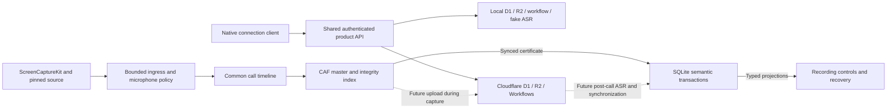

# Recording architecture

The [approved foundation decision](https://github.com/apshenichniy/trigo/issues/48)
defines one transactional local archive, one recoverable stereo recording master
per call and one shared authenticated API. This is the current implementation
map. Use [setup](setup.md) for commands and [the glossary](../../CONTEXT.md) for
product terms; historical tickets and acceptance logs retain their original
observations rather than defining competing supported paths.

The authenticated product endpoint today is `GET /v1/status`. Other `/v1/`
operations authenticate before returning the stable unavailable error. The
diagram's upload/ASR/synchronization arrows are downstream product work, not
running background services in the current app.

## Native owners

| Boundary                     | Owner and responsibility                                                                                                                                                                                                                              |
| ---------------------------- | ----------------------------------------------------------------------------------------------------------------------------------------------------------------------------------------------------------------------------------------------------- |
| App lifetime                 | `DesktopComposition` retains `RecordingApplication`, which admits one process through `AppInstanceLease` before connection recovery, shortcut, readiness or capture setup. Namespace ownership lasts until process exit.                              |
| Desktop commands and windows | `DesktopShell` owns bootstrap, Start-or-reveal and guarded Quit. The shared `TrigoDesktop` presentation owns the status item, one library window, separate Settings and recording controls. Window closure does not end services.                     |
| User policy                  | `RecordingCoordinator` owns pairing eligibility, pinned source, recording controls and explicit readiness actions. Screen/system audio, microphone availability, recording mute and credential access have distinct states.                           |
| OS capture                   | `ScreenCaptureRecording` owns ScreenCaptureKit stream lifetimes. `CaptureSource` resolves the selected application instance; a selected window does not isolate its tab/window audio.                                                                 |
| Callback processing          | `CaptureAudioIngress` bounds admitted buffers; routing and decoder boundaries enforce stream identity and effective microphone suppression before persistence. `CaptureTimeline` aligns both tracks on one call-relative clock.                       |
| Durable media                | `CaptureMediaWriter` coordinates `RecoverableMediaMaster` and its append-only integrity index, then publishes the verified progress certificate to the repository. Only its serial capture owner may mutate/read the active writer.                   |
| Archive transactions         | `LocalRepository` and its `Repository*` operations own capture admission, verified progress, stop/finalization intent, final publication, revision import and durable work. `SQLiteDatabase` owns validated store admission and scheduled SQL access. |
| Recovery and completion      | `RecordingRecovery` finds admitted sessions; `CaptureArchiveSession` reconciles external evidence and completes publication. Recovery never resumes devices. Production returns compact `CaptureCompletion`; full aggregates are explicit APIs.       |

The native service sources live under [`apps/macos/Native`](../../apps/macos/Native/),
with shared AppKit/SwiftUI presentation under
[`apps/macos/Desktop`](../../apps/macos/Desktop/). The
[desktop shell handoff](acceptance-71.md) describes production/fixture composition
and the remaining UI acceptance and integration owners.
[Capture behavior](capture.md), [recording controls](recording-controls.md) and
the [capture master interface](capture-master-interface.md) describe their public
contracts without duplicating the implementation. ScreenCaptureKit remains the
OS adapter; this refactor did not introduce a second capture API.

## SQLite and exact evidence bytes

`Archive/archive.sqlite3` is the canonical metadata and durable operation store.
Typed entities, bounded query projections and semantic transactions replace the
independent JSON archive/lifecycle/journal writers. Beginning capture commits its
stable identities, initial call, lifecycle and any associated work together.
Final publication commits the final witness, call/audio reference, lifecycle and
prepared work together. Revision import likewise publishes the revision and its
associated durable work through the repository boundary.

The six lifecycle dimensions remain independently meaningful: capture, upload,
transcription, local import, replica and deletion. A local finalization does not
mark upload or transcription complete. Operation identity, intent, attempts,
failure, acknowledgement and uncertain caller outcomes remain durable; remote
execution of that work is a later product responsibility.

JSON is a versioned exchange/export representation. It is not an always-present,
independently mutable per-call file tree. A published snapshot retains its exact
original bytes and SHA-256 in SQLite, alongside typed projections. Immutable
identity plus equal bytes is idempotent; different bytes conflict, even if decoded
JSON values compare equal. Transcript revisions and revision-scoped speaker
annotations remain retained, and manifest versions advance monotonically.
Normal typed queries do not decode and validate ordinary rows through JSON.

SQLite cannot atomically commit external media, a Keychain item or a remote
request. The media owner synchronizes bytes and their integrity record before
the repository publishes the confirmed cursor. A failure after a commit can
leave the caller uncertain; replay preserves the original operation and evidence
identities. File length alone cannot advance confirmed media progress.
Connection metadata and pending/committed/retired Keychain ownership retain their
separate transaction protocol outside the archive and exported data.

The current schema is version 2. A legacy archive, unsupported schema, foreign
identity or corrupt store is rejected without mutation; there is no legacy
migration or silent reset. The [clean test archive procedure](setup.md#clean-test-archive)
selects a fresh disposable namespace and preserves old/private data.

## One master, independent intervals

Each call retains `media/master.caf` and `media/master.index`. The selected
`caf-lpcm-s16le-16000-stereo-v1` profile holds microphone channel 0 and application
channel 1 for up to three hours. Suppressed/unavailable samples are silence before
hashing or range access. The immutable CAF header and synchronized index make
confirmed byte ranges stable during capture and through finalization.

Integrity checkpoints, upload parts and ASR submission intervals are independent.
The master may exceed the 8 MiB application request cap; each transport request
must respect it and R2's multipart constraints. Multipart ETags do not replace
whole-master checksum verification. Bounded extraction retains parent master
identity/hash, original channels, call-relative frames and transformation profile.
See the [concrete media interface](capture-master-interface.md) for cursor,
finalization, extraction and corruption/recovery rules.

The local master remains until a complete verified server storage receipt is
durably committed locally. Neither partial upload nor ASR success authorizes
cleanup. Automatic cleanup after that receipt, upload during recording and
post-call ASR remain required downstream; permanent offline playback is not a
requirement. The old WAVE provider-probe profile is still a separate #13 input,
not an alternative production recording layout.

## Contracts, API and environments

[`packages/contracts`](../../packages/contracts/README.md) authors exchange shapes
with Effect Schema and derives TypeScript, JSON Schema and typed Swift outputs.
Both languages enforce closed objects, required nulls, timestamp/UUID distinctions,
safe integers and semantic/reference/hash boundaries using the shared fixtures.
AJV remains a TypeScript parity validator; cached native JSON Schema validation
remains alongside Swift Codable. Neither is an alternate schema authoring path.
Immutable binary/document transport must retain the original bytes instead of
decoding and re-encoding them inside HttpApi JSON routes.

`apps/server/src/product-api.ts` declares the Effect HttpApi surface and
`product-handler.ts` supplies common authentication, status, error and compatibility
behavior. `local-worker.ts` and `cloud-worker.ts` delegate product requests to it;
they select adapters rather than maintain separate product implementations.

`infra/local.ts` composes worktree-isolated D1, R2 and workflow state with fake
ASR and no live Workers AI binding. Local `__local` probes are gated acceptance
helpers, not a fixture-only product API. The real native URLSession smoke uses
the same authenticated status and durable binding, with an in-memory credential
adapter and disposable metadata. It does not open the installed app or prove TCC
or app-owned Keychain behavior.

`infra/cloud.ts` retains Alchemy and its Cloudflare remote state backend. Named
dev/personal stages, dedicated profiles, account checks and owner handoffs stay
explicit. Desktop apps receive only scoped Trigo credentials in Keychain;
operator credentials never become app configuration. The local dev-only bridge
permits exactly its selected loopback HTTP origin. Ordinary connections remain
HTTPS, with first pairing required and later offline recording eligibility
preserved separately from server-operation readiness.

## Commands and remaining gates

Root commands reuse the process, timing, native check, locking, generation and
environment operations under `scripts/`. Invalid wrapper arguments fail before
their operations; checks do not forward arbitrary options to Xcode/Alchemy.
There is no placeholder cloud command, duplicate IaC implementation or standalone
legacy file-store/fixture-route path. The pinned `repos/effect` reference remains
read-only and available through explicit searches; ordinary navigation excludes it.

| Evidence or next gate                     | Meaning                                                                                                                                                                                                                                                                                                                                                                                                                                                                                                                                                                                                            |
| ----------------------------------------- | ------------------------------------------------------------------------------------------------------------------------------------------------------------------------------------------------------------------------------------------------------------------------------------------------------------------------------------------------------------------------------------------------------------------------------------------------------------------------------------------------------------------------------------------------------------------------------------------------------------------ |
| #49 checks, #50 contracts                 | Versioned native caches/current-source builds and strict cross-language parity. [Timing baseline](acceptance-49.md) remains a different workload from the expanded suite.                                                                                                                                                                                                                                                                                                                                                                                                                                          |
| #51 proof, #52 repository, #53 production | Distinct evidence layers: [format proof](acceptance-51.md), [historical repository integration](acceptance-52.md), [production master](acceptance-53.md). #52's transitional WAVE receipt and accelerated contention fixture were superseded in #53; its original measurements are retained as history.                                                                                                                                                                                                                                                                                                            |
| #54 API, #55 readiness                    | [Shared local/cloud API](acceptance-54.md) and [readiness/credential implementation](acceptance-55.md). Deterministic adapters do not establish physical prompt behavior.                                                                                                                                                                                                                                                                                                                                                                                                                                          |
| #48 final-source checks                   | [Final epic evidence](acceptance-48.md), with [command/documentation acceptance](acceptance-56.md), full required gates and isolated 1h/3h production resource proofs including full extraction. Concurrent suite RSS is not the per-capture resource measurement.                                                                                                                                                                                                                                                                                                                                                 |
| #57 installed acceptance                  | [Installed evidence and limitations](acceptance-57.md): controlled capture/recovery/source exit, authenticated unchanged relaunch/save, and the final clean signed rebuild. Physical microphone unplug/reconnect is unavailable with built-in-only hardware. Intermittent startup overflow is unresolved and owner-deferred in [#60](https://github.com/apshenichniy/trigo/issues/60). The observed dialog is direct screen/system-audio consent/reminder UI; no Allow action is confirmed and recurrence cause remains unknown. Same worktree, bridge, identity and installed path; no global TCC/Keychain reset. |
| #13 hosted ASR                            | Hosted compatibility of master-derived inputs/Nova-3 remains unverified independently of historical WAVE probes and fake ASR success.                                                                                                                                                                                                                                                                                                                                                                                                                                                                              |
| #32 personal deployment                   | The [infrastructure recovery rehearsal](cloudflare-state-recovery.md) gates first personal deployment, not local development. Read-only source research is not a completed recovery rehearsal. Alchemy state is not an archive backup.                                                                                                                                                                                                                                                                                                                                                                             |
| #10 product workflow                      | Production upload during capture, post-call ASR/sync, verified-receipt cleanup, transcript UI, compact measured recording feedback, double Left Control / Input Monitoring (#58) and real-call acceptance remain required.                                                                                                                                                                                                                                                                                                                                                                                         |

Normal [cloud operations](cloud.md) retain explicit account/stage selection and
one deployment writer per stack/stage. Local checks do not deploy or run paid
inference, and passing them does not authorize merging or deployment.
